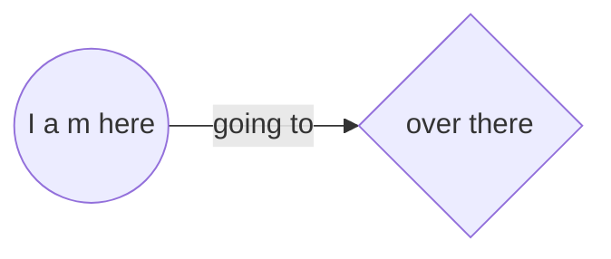

- 👋 Hi, I’m @cassiofreitas
- 👀 I’m interested in digital transformation and security as a service
- ---
- 🌱 I’m currently learning github (cli is still fooling me :-) )
- 🌱 I'm also learning HTML5, CSS, JavaScript and Python
- 🌱 Since June 1st 2022, learning C# at Digital House/ Mercado Eletônico
- ---
- 💞️ I’m looking to collaborate on cloud security solutions
- 📫 How to reach me: cassiofreitas@cassiofreitas.com

<!---
cassiofreitas/cassiofreitas is a ✨ special ✨ repository because its `README.md` (this file) appears on your GitHub profile.
You can click the Preview link to take a look at your changes.
--->

# Things I am learning to be a MarkDown :ninja:

## MarkDown.

It has been a funny task, because I love to learn new things everyday.

I will use this skill to enhance my README.md files and to build my CV at GitHub, using MarkDown.

### How about today `21/02/2022`

Today, I explored [`emoji-cheat-sheet`](https://github.com/ikatyang/emoji-cheat-sheet/blob/master/README.md)

A lot of possibilities.

Examples:

- ```:octocat:``` shows :octocat:
- ```:brazil:``` shows :brazil:
- ```:ninja:``` show :ninja:

I am also begining my learning path of [some advanced formatting](https://docs.github.com/en/get-started/writing-on-github/working-with-advanced-formatting)

Example I am curious about: [Creating diagrams](https://docs.github.com/en/get-started/writing-on-github/working-with-advanced-formatting/creating-diagrams)

:atom: 17/04/2022: I just found this great site about [Mermaid Live editor](https://mermaid.live/).

Using this live editor is much easier to draw diagrams. 🤫



### Next episode

<details><summary>Next time I will explore this feature.</summary>
<p>
  
  ```javascript
    console.log("Hello world"); 😃
  ```
  
</p>
</details>
